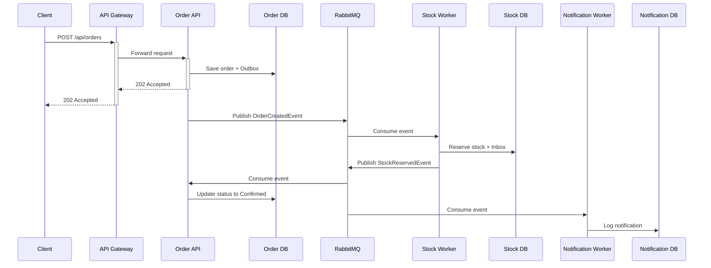

# 🛒 E-Commerce Microservices Case Study

Modern, production-ready e-commerce platform built with .NET 8 microservices architecture, demonstrating distributed transactions, event-driven communication, and comprehensive observability.

---

## 🚀 Quick Start

### Prerequisites
- **Docker & Docker Compose** (required)
- **.NET 8 SDK** (optional, for local development)

### Run the System

```bash
cd deploy
docker compose up -d --build
```

Wait for all services to be healthy (~30 seconds), then access:

| Service | URL | Credentials |
|---------|-----|-------------|
| **API Gateway** | http://localhost:5080 | - |
| **Aspire Dashboard** | http://localhost:18888 | - |
| **RabbitMQ Management** | http://localhost:15672 | `guest` / `guest` |
| **Redis Insight** | http://localhost:5540 | - |
| **Elasticsearch** | http://localhost:9200 | - |

> **Note**: All API requests should go through the API Gateway (`http://localhost:5080`). Individual services are not exposed externally. For Swagger documentation, use the individual service ports during development only:
> - Order API: http://localhost:5001/swagger
> - Stock API: http://localhost:5002/swagger
> - Product API: http://localhost:5081/swagger

---

## 📦 Architecture Overview

### Microservices

| Service | Port | Description |
|---------|------|-------------|
| **API Gateway** | 5080 | YARP reverse proxy, JWT validation (authentication), centralized routing and request forwarding |
| **Order API** | (internal) | Order lifecycle management, Saga orchestration |
| **Stock API** | (internal) | Inventory management, stock reservations |
| **Product API** | (internal) | Product catalog, Elasticsearch search |
| **Stock Worker** | - | Consumes `OrderCreatedEvent`, reserves stock |
| **Notification Worker** | - | Consumes stock events, sends notifications |

### Infrastructure

| Component | Port | Credentials |
|-----------|------|-------------|
| **Order DB** (PostgreSQL) | 5433 | `orderuser` / `orderpass` |
| **Stock DB** (PostgreSQL) | 5434 | `stockuser` / `stockpass` |
| **Notification DB** (PostgreSQL) | 5435 | `notifuser` / `notifpass` |
| **Product DB** (PostgreSQL) | 5436 | `productuser` / `productpass` |
| **Redis** | 6379 | - |
| **Redis Insight** | 5540 | - |
| **RabbitMQ** | 5672 | `guest` / `guest` |
| **Elasticsearch** | 9200 | - |

---

## 🎯 Key Patterns & Features

### 1. **Saga Pattern (Hybrid Approach)**
- **MassTransit State Machine** tracks order lifecycle (`OrderStateMachine`)
- **Event-driven communication** (Choreography) between services
- **Compensating transactions** for failure scenarios

### 2. **Transactional Outbox Pattern**
- Guarantees **at-least-once delivery** of domain events
- Prevents dual-write problem (DB + Message Broker)
- Background publisher ensures eventual consistency

### 3. **Inbox Pattern**
- **Idempotent consumers** via `MessageId` tracking
- Prevents duplicate message processing
- Ensures exactly-once semantics

### 4. **CQRS + MediatR**
- Clear separation of Commands and Queries
- Centralized request/response pipeline
- Validation, logging, and behavior pipelines

### 5. **Observability (OpenTelemetry)**
- **Distributed Tracing** (Jaeger-compatible)
- **Structured Logging** (Serilog)
- **Metrics** (Prometheus-compatible)
- **Aspire Dashboard** for real-time monitoring

### 6. **Clean Architecture**
- Thin controllers (no business logic)
- `Result<T>` pattern for error handling
- Domain-driven design principles

---

## 🔐 Authentication

### Generate JWT Token

```bash
curl -X POST http://localhost:5080/dev/generate-token \
  -H "Content-Type: application/json" \
  -d '{"userId": "user123", "role": "Customer"}'
```

### Use Token in Swagger
1. Click **"Authorize"** button
2. Paste token: `Bearer <your-token>`
3. Click **"Authorize"**

---

## 📝 Example Workflows

### Create an Order (Happy Path)

```bash
# 1. Generate token
TOKEN=$(curl -s -X POST http://localhost:5000/dev/generate-token \
  -H "Content-Type: application/json" \
  -d '{"userId":"user123","role":"Customer"}' | jq -r '.token')

# 2. Create order
curl -X POST http://localhost:5080/api/orders \
  -H "Authorization: Bearer $TOKEN" \
  -H "Content-Type: application/json" \
  -d '{
    "items": [
      {"productId": 1, "quantity": 2}
    ],
    "shippingAddress": {
      "street": "123 Main St",
      "city": "Istanbul",
      "postalCode": "34000",
      "country": "Turkey"
    }
  }'

# Expected: 202 Accepted
```

### Check Order Status

```bash
curl http://localhost:5080/api/orders/{orderId} \
  -H "Authorization: Bearer $TOKEN"
```

### Search Products

```bash
# Search by keyword
curl "http://localhost:5080/api/products/search?q=laptop"

# Get all products
curl http://localhost:5080/api/products

# Get product by ID
curl http://localhost:5080/api/products/1
```

---

## 🐇 Event Flow

### Order Creation Flow



### Events

| Event | Publisher | Consumers |
|-------|-----------|-----------|
| `OrderCreatedEvent` | Order API | Stock Worker |
| `StockReservedEvent` | Stock Worker | Order API, Notification Worker |
| `StockReservationFailedEvent` | Stock Worker | Order API, Notification Worker |

---

## 📊 Observability

### Aspire Dashboard (http://localhost:18888)

- **Traces**: Distributed tracing across services
- **Logs**: Structured logs with correlation IDs
- **Metrics**: Service health, queue depth, latency

### Example: Trace an Order

1. Create an order via Swagger
2. Open Aspire Dashboard
3. Go to **"Traces"** tab
4. Find your request by `OrderId` or `CorrelationId`
5. View the entire flow: Gateway → Order API → RabbitMQ → Stock Worker → ...

---

## 🧪 Testing

### Health Checks

```bash
# API Gateway
curl http://localhost:5080/health

# Individual services (via Gateway)
curl http://localhost:5080/api/orders/health
curl http://localhost:5080/api/products/health
curl http://localhost:5080/api/stock/health
```

### RabbitMQ Queues

Visit http://localhost:15672 and check:
- `order-created` queue
- `stock-reserved` queue
- `stock-failed` queue

---

## 🛠️ Development

### Run Locally (Without Docker)

```bash
# Start infrastructure only
cd deploy
docker compose up -d postgres_order postgres_stock postgres_notification postgres_product rabbitmq redis elasticsearch

# Run services
cd ../src/Services/Order/ECommerce.Order.Api
dotnet run

# (Repeat for other services)
```

### Database Migrations

```bash
cd src/Services/Order/ECommerce.Order.Infrastructure
dotnet ef migrations add MigrationName
dotnet ef database update
```

---

## 📚 Documentation

- **[ARCHITECTURE.md](ARCHITECTURE.md)**: Detailed architecture diagrams and decisions
---

## 🔧 Technology Stack

| Category | Technologies |
|----------|-------------|
| **Framework** | .NET 8, ASP.NET Core |
| **Messaging** | RabbitMQ, MassTransit |
| **Databases** | PostgreSQL, Redis, Elasticsearch |
| **Observability** | OpenTelemetry, Serilog, Aspire Dashboard |
| **API Gateway** | YARP |
| **Patterns** | CQRS, MediatR, Saga, Outbox/Inbox |
| **Containerization** | Docker, Docker Compose |

